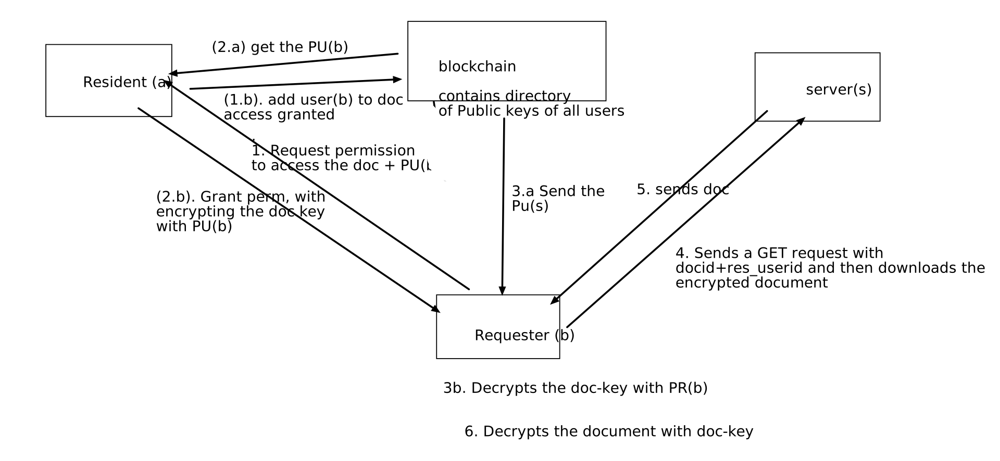

# Digital locker using Ethereum Blockchain

## How to setup

### Clone repository

```powershell
git clone https://github.com/jai-singhal/digiLocker

# cd to digilocker
cd digiLocker
```

### create virtualenv

```powershell
pip install virtualenv

# create virtualenv in digilocker dir
virtualenv .

# activate the virtualenv
./Scripts/activate
```

### Install required packages

```powershell
pip install -r requirements.txt
```

### Run the server
```powershell
python main.py
```

## System Design

### Login


### Document uploading



## Resources

## Building etherium dapps with metamask[*]

- https://medium.com/crowdbotics/building-ethereum-dapps-with-meta-mask-9bd0685dfd57

## Setup local ganache and private network[*]
- https://medium.com/@tricialobo/testing-smart-contracts-with-remix-ganache-and-metamask-a62d5fe525a1

### How to generate multiple keys

- https://crypto.stackexchange.com/questions/76588/multiple-aes-key-derivation-from-a-master-key
- https://pycryptodome.readthedocs.io/en/latest/src/protocol/kdf.html

### How to login using metamask

- http://www.programmersought.com/article/6535156845/


## Discussion with mentor

1. Server will authenticate the requester using IDA
2. Relay the request to the Resident
3. Use OTP based authenticacation, directly from the requester. 
4. Encrypt the document key with the Identity of the requester. 
5. Requester has the private kay correponding to that ID, therefore it will be able to decrypt the document


## Todos

These are tasks we have to do in future